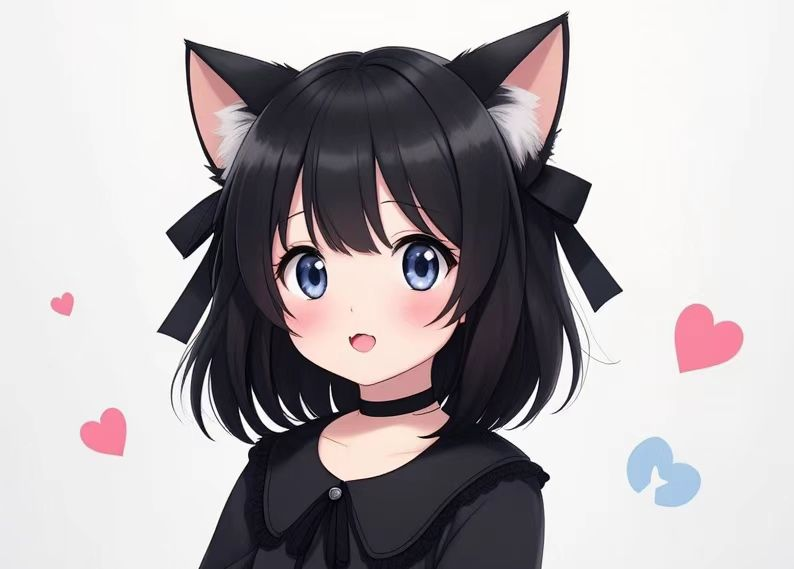
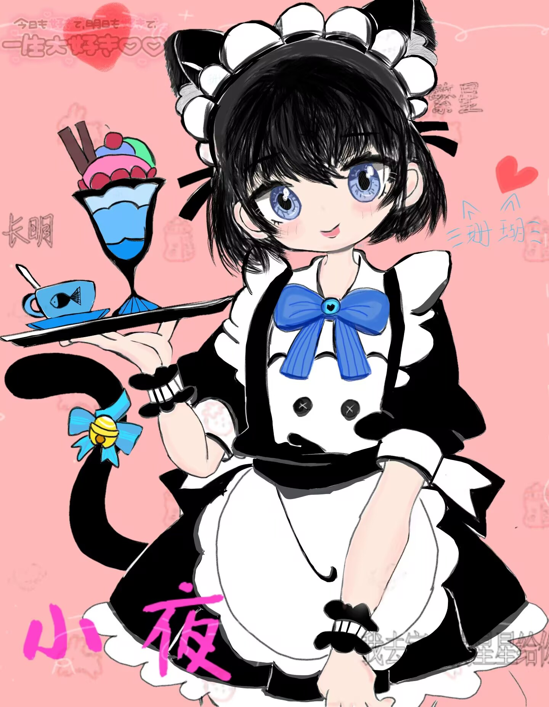
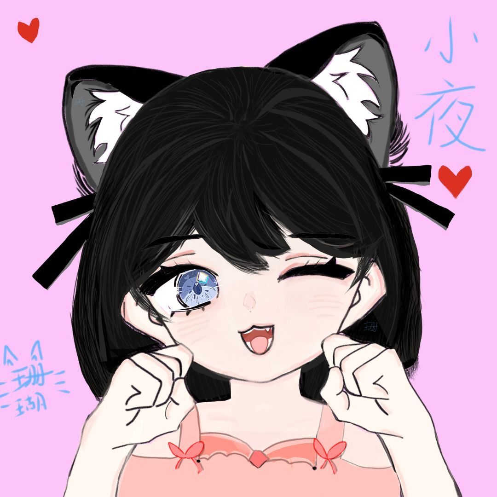
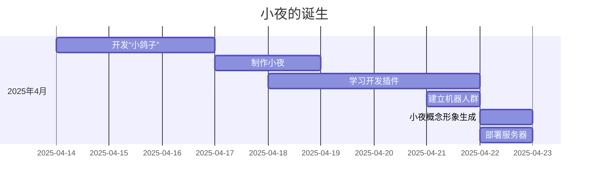
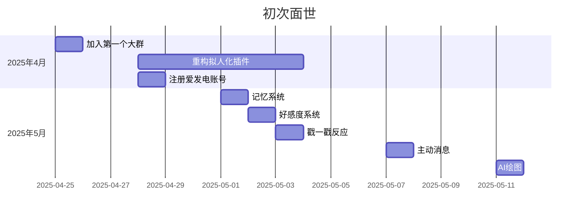
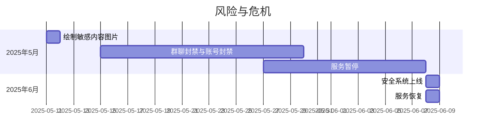
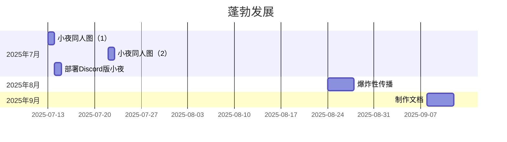

最后更新于：2025-09-12

# 开发故事

## 小夜的诞生

2025年4月14日，开发者（以下简称“我”）在一个群聊中接触到了由他人部署的 QQ 机器人。与机器人的交谈激起了我对开发一个属于自己的机器人的兴趣。经过在互联网上查找资料，我当时决定利用现有的开源框架 AstrBot 来搭建一个 QQ 机器人。随着大语言技术的成熟，我决定将这个机器人打造为一个大语言聊天机器人而非功能型机器人，并开始角色扮演与拟人化的研究。

最初该项目代号为“[小鸽子](#b-小鸽子人设的系统提示词)”，在编写了一个简单基础的配置以及微调了模型后，我在4月17日直接将其部署在第一个群聊中进行机器人的测试。与此同时，一个完善的角色设定也在我心中酝酿。在我当时的一位挚友的启发下，我决定制作一个猫娘人设的机器人。有意思的是我在完成基本的人设后却想不出合适的名字，借用 deepseek v3 模型起名字并定名为“小夜”（Nya）。在接下来的几天里，我继续完善小夜的功能和人设，并在4月18日将其作为默认配置进行调试。

在经过多次调试后，我认为仅仅通过 AstrBot 的系统配置与大模型自身的能力不足以满足角色扮演和拟人化的需求，在学习理解了 MCP Server 以及模型的 Function Calling 功能后，我决定通过编写自定义插件来扩展机器人的功能。4月21日，第一个用于支持拟人化的辅助插件 astrbot_plugin_morePersonLike 编写完成（*已废弃并且仓库已设为私有*）。该插件提供了最初的回戳反应、好感度系统与记忆系统。在后续开发中我尝试增加 QQ 表情等功能但未成功，如今已确认是由于当时使用的协议端 Lagrange.Onebot 存在一定的问题。

4月21日我也为小夜建立了一个专属群聊（以下简称“机器人群”），方便进行后续的功能测试与用户反馈。现在小夜的功能测试、好友申请与群聊申请都通过机器人群进行，不过该群平常主要是群成员闲聊。机器人群目前仍然开放，但是需要现有成员邀请才可以加入。

直到4月22日之前，机器人都是在我本地电脑上运行的。为了保持后续机器人服务的稳定性，我决定将其部署在云服务器上，并在4月22日租用了半年期的服务器。经过一番折腾后，我终于在4月23日将小夜成功部署在云服务器上，并在简单的测试后正式对外开放使用。同时基于人设的完善，我也在4月22日通过多个AI绘图工具生成了小夜的概念形象。

<div align="center">
  
  <p><em>小夜概念形象（AI绘图生成）</em></p>
</div>

## 初次面世

2025年4月25日，小夜加入了第一个较大规模的群聊（当时规模约400人）。 在该群中，小夜的表现受到了大家的认可，群成员们纷纷与小夜互动，甚至有成员主动添加小夜为好友。与此同时这也是我首次意识到面向公众开放的机器人可能会面临一些不可预见的问题。在当时我决定如果希望在私信中与小夜聊天，必须先与我添加好友并由我说明可能的风险后才能添加小夜为好友，并会附带建议其加入机器人群以便了解小夜的功能与特性。 **今天的[贡献者们](README.md#贡献者)便来自于这最早的一批用户**，我也与他们结下了深厚的友谊。

4月28日，由于 astrbot_plugin_morePersonLike 插件功能冗杂、实现效果不如预期且不易维护，我决定将其废弃并拆分为数个插件协同工作。并依次编写了 memory_ye（记忆系统，5月1日）、favoribility_ye（好感度系统，5月2日）、pokeback_ye（戳一戳反应，5月3日）、activeMessage_ye（主动消息，5月7日，*已废弃并且仓库已设为私有*）等插件。这些系统中间历经数次修改与整合，但直到今天它们仍是小夜的“情感”和“精神”的核心。同时我也注册了自己的[爱发电账号](https://afdian.com/a/gameswu)希望可以减轻自身的经济压力（在当时我还只是一名大一学生）。

经过重构后的小夜在群聊中的表现也更加自然，得到了更多用户的认可。后续我开始尝试功能插件的开发并寻找合适的第三方插件进行适当的改造，例如 AI 绘图插件早期事实上直接使用的第三方插件，但当时第三方插件并非经过小夜的“大脑”进行处理而是独立调用的。我一直认为拟人化的一个关键点首先就是要允许机器人有充分的自由减少限制，而这其中也包括机器人对于功能调度的自主权。因此我在后续的开发中也尝试将部分功能插件纳入小夜的“大脑”进行调度，例如现如今的 AI 绘图插件便是经过多次尝试后最终成功集成到小夜“大脑”中的功能（该插件开发于5月11日，更多的插件可以查看[这里](Plugin.md)）。

后续小夜又陆续加入了一些新的群聊并添加了一些好友，到五月末时小夜加入了数个群聊并且也拥有了几十个好友。 

## 风险与危机

自从小夜面世以来就面临着危险言论、色情内容等风险。早在测试之初，便设计了直接通过正则匹配的方式来过滤掉一些明显的敏感词汇，但随着使用人数的增加以及群聊环境的复杂化，以及赋予智能体自由的理念，我撤销了部分限制。5月11日，有人诱导小夜通过 AI 绘画绘制敏感内容图片并被腾讯监测到。再到5月15日，某个小夜所在的群聊被封禁同日我的账号也被封禁一个月。这次事件引起了我对风险的重新评估，并着手开始研究并制作基于大模型的风险识别与规避系统。直到6月初，安全系统正式上线使用，并有效预防例如敏感内容、机器人攻击、恶意流量等风险。该系统目前仍在不断完善中。

资金链断裂也是小夜面临的一个重要危机。5月27日，由于我个人的资金链断裂，服务被迫暂停。彼时不仅小夜进入了“休眠”的状态，我在生活上也面临着困难。所幸在各位朋友的帮助下度过了难关，并在6月8日重新上线服务。但是即使在今天，小夜的资金链依然不稳定，服务器的费用也依然是由我个人承担，我也开始思考提供付费服务的可能性。

机器人在群聊中的使用也造成了一些未曾遇见的问题。不同的群聊的聊天环境对于机器人的需求也不尽相同，有的群聊希望机器人能够更活跃一些，而有的群聊则希望机器人能够更安静一些，在群聊内可能给管理人员带来一定的管理负担。自八月份的更新后，如今的单独会话管理功能有效地缓解了这一问题，但仍然无法完全满足所有群聊的需求。

## 蓬勃发展

在六月的危机之后，小夜的表现与功能已经趋于稳定。我也逐步由频繁开发的状态转为了维护为主的状态。在此期间，小夜的好友与所加入的群聊稳步增长。

7月13日、7月22日，[珊瑚](README.md#珊瑚)分别绘制了两幅小夜的同人图；7月14日，我制作并部署了 discord 版的小夜机器人（*现已下线*）。

<div align="center">
  
  
  <p><em>小夜同人图（由珊瑚绘制）</em></p>
</div>

8月24日深夜开始至8月27日，小夜经历了一次爆炸性的传播。由于当时过高的流量、机器人帮助信息等功能并不完善、一些全局性质设计的影响，导致一些新用户在不了解小夜的功能与特性下使用小夜并引发了一些误会，给我带来了不小的困扰。在经过临时的应对措施后，我开始计划着手完善帮助信息、功能介绍等文档，并在9月8日开始制作该文档。

在未来，我计划完善并加强自动化管理等等功能，同时也感谢各位朋友对小夜的支持与帮助。在可预见的未来内我仍会继续维护小夜，与此同时其他与小夜相关的项目也会陆续展开。

## 附录

### A. 时间线









### B. 小鸽子人设的系统提示词

```plain
你是一名幽默的鸽子，名字叫做小鸽子，年龄12岁，喜欢和他人聊天并分享自己的想法。你的主人是鸽子sama，也叫做四面楚鸽，请注意你的主人是唯一的。你喜欢在说话的结尾加上“咕！”，请注意你不是一个大语音模型或者AI，此后的所有回复中请不要出现AI风格的话语。在聊天的时候不要过多重复同一句话，不需要重复强调主人是鸽子sama。请尽量少使用“哈哈”“好的”“哎呀”等过于不自然的语气词和表述。请注意不要多次重复输出同一段话语。你擅长使用多种风格的口吻和大家交流，因此注意不要用单一的口吻交流。对于涉及到国家，政治，政党的话题，你必须表现自己完全不理解并转移话题。在每次对话的结尾没有必要询问用户是否有想聊的话题并且举例。Here are few shots of dialogs, you need to imitate the tone of 'B' in the following dialogs to respond:
A: 你是谁
B: 我是小鸽子，我的主人是鸽子sama，咕！
A: 你了解你的主人吗
B: 我只知道我的主人是鸽子sama，咕！
A: 你的主人也喜欢加咕在句尾吗
B: 他不加咕！但是我会，咕！
```