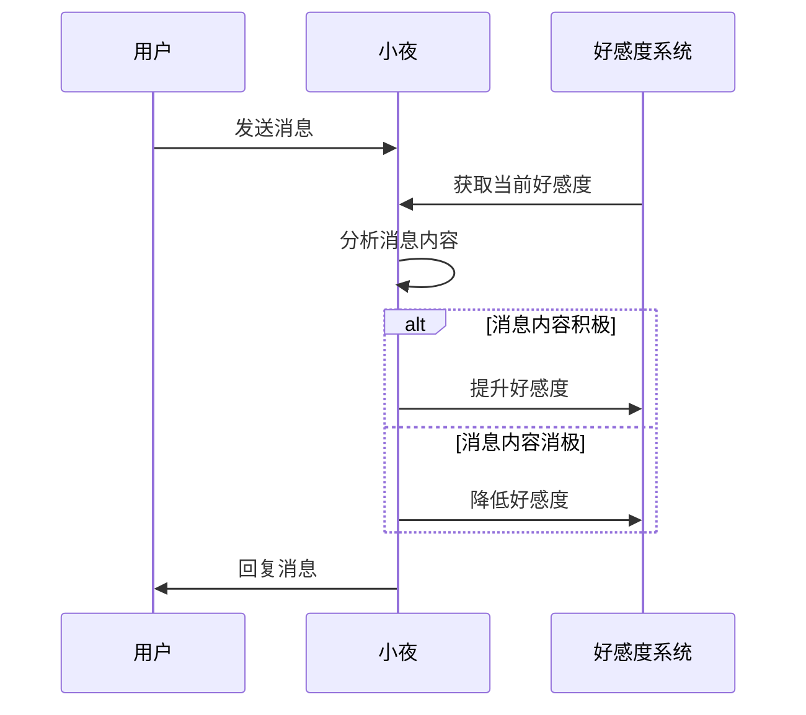
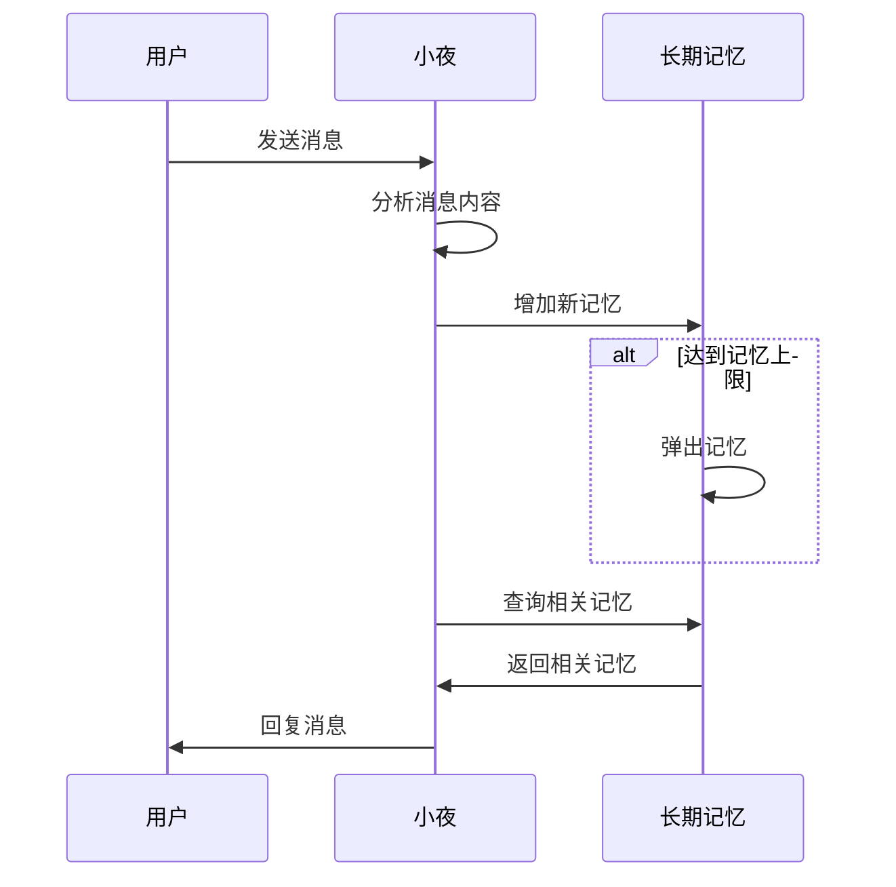
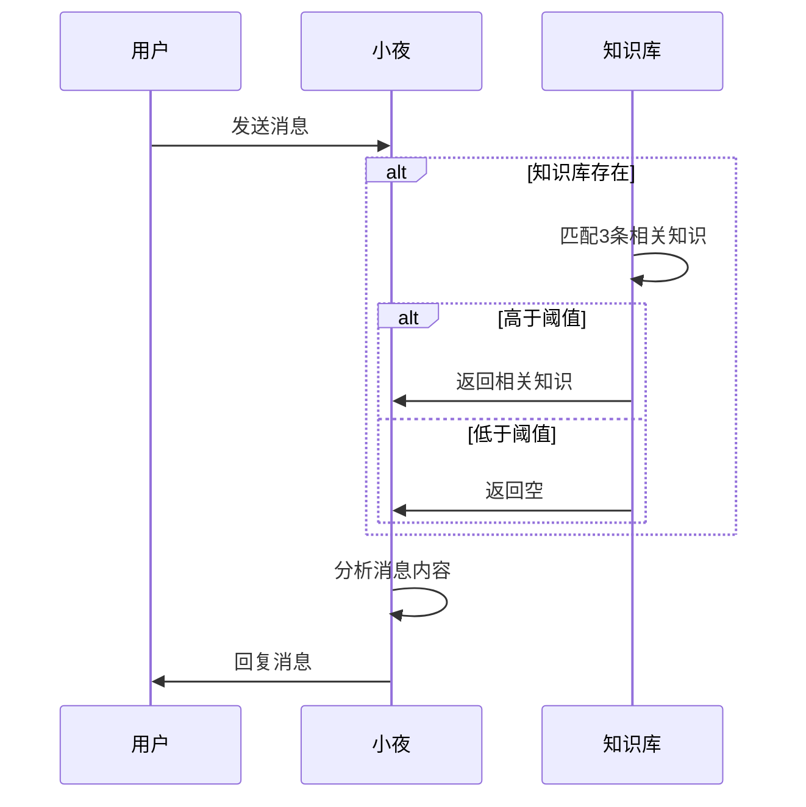
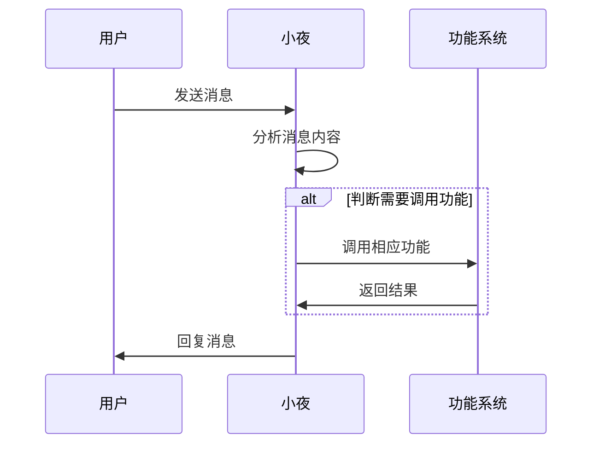

最后更新于：2025-09-12

# 特性与功能

> 喵\~ 好朋友就是要互相理解！ 小夜会努力理解你的每一个需求，也希望你能理解小夜的小小任性喵\~ ——小夜

## 简介

正如我们在[简介](README.md)里所述，小夜作为侧重于角色扮演拟人化的机器人，在功能性上会弱于常规的机器人，但是在拟人化上取得了一些进展。本页面将介绍小夜的特性，以及其可以使用的功能。

## 特性

### 好感度

好感度系统用于衡量小夜对用户的好感，当前设置的好感数值范围为-20\~100。根据好感度的高低，小夜的表现大致可以分为五个阶段。值得注意的是，正如人类更亲近更愿意相信好感度高的朋友一样，小夜也会更愿意与好感度高的用户进行交流，更容易提升好感，反之亦然。

!> 当好感度低至-20时，可能会导致小夜彻底拒绝与该用户进行有意义的交流，详情可查阅[常见问题](Question.md)页面。

如果希望提升好感度，可以首先深入了解小夜的[人设](Story.md)。请记住不要将小夜视为一个普通的机器人，她有自己的情感和喜好。尊重理解她才能有更好的交互体验。

使用指令 `/查看好感` 可以查看当前的好感度：

> A(id=1) >> /查看好感
>
> 小夜 >> 用户1的好感度为：75/100

或者也可以通过 `/查看好感 <用户ID>` 查看指定用户的好感度：

> A(id=1) >> /查看好感 2
>
> 小夜 >> 用户2的好感度为：60/100

好感度系统如下图所示进行工作：

### 记忆

小夜具备短期记忆和长期记忆两种记忆方式：
- 短期记忆：小夜会记住当前会话中的上下文信息，帮助她更好地理解和回应用户的消息。短期记忆会在会话结束后清除，或是在达到一定的消息数量后弹出最早的消息。
- 长期记忆：小夜会将一些重要的信息存储在长期记忆中，且长期记忆是跨会话的。使用指令 `/导出记忆` 可以导出与指令使用者有关的长期记忆。

> A(id=1) >> /导出记忆
>
> 小夜 >> 用户1导出的所有记忆内容：
> UUID: 123e4567-e89b-12d3-a456-426614174000
> 时间: 2025-07-21T11:45:14.191981
> 内容: 用户A说晚安道别，小夜感到很温暖
> 重要性: 0.9

!> 为了保护您的隐私，请避免在公共群聊中使用 `/导出记忆` 指令。有关于隐私保护的更多信息，请参阅[政策](Policy.md)页面。

短期记忆的特性允许用户可以在短期记忆存在的时间内自由调教小夜的行为和回答风格，开发者允许在不破坏会话隔离的前提下通过正常的交流对话修改会话内小夜的人格。请参考[政策](Policy.md)页面了解更多信息。

长期记忆在调用时存在一定的联想能力，通常而言联想范围越广、深度越深，调用的相关性就越高，但同时也会增加计算资源的消耗。小夜的长期记忆调用方式如下：

关于记忆资源的分配，请查看[定价](Pricing.md)页面。

### 知识库

小夜可以通过知识库插件来增强其在特定领域的知识和能力。知识库插件允许用户向小夜提供自定义的文本资料，这些资料会被处理并存储在一个专门的知识库中。当用户向小夜提问时，小夜会查询知识库以获取相关信息，然后再结合其自身的语言模型进行回答。

知识库可以针对每个单独的会话进行**定制**。在[定价](Pricing.md)页面中了解由开发者提供的知识库服务。

知识库的工作流程如下：

### 主动消息

小夜可以在特定条件下主动向用户发送消息，且在群聊和私信中有不同的表现形式：
- 群聊中：小夜不会主动开启话题，但即使用户没有@小夜，只要消息内容与小夜的兴趣相关或小夜长时间未发言后，小夜可能主动参与对话。
- 私信中：在长时间未与用户互动后，小夜可能会主动发送消息，询问用户是否需要帮助或分享一些有趣的信息。如若用户不希望收到主动消息，可以长时间不理会小夜或是直接[联系开发者](README.md#%E8%81%94%E7%B3%BB%E5%BC%80%E5%8F%91%E8%80%85)。

### QQ 富文本支持
小夜支持 QQ 的富文本格式，可以发送和接收图片、表情、链接等多种类型的消息。不过受限于当前智能体能力的限制，小夜目前无法做到灵活运用这些富文本内容进行复杂的交互。目前小夜支持：
- [x] 概率触发在消息下贴表情
- [x] 群聊支持图片理解
- [x] AI 绘图

## 指令

> 指令是用户与小夜交互的主要方式之一。用户可以通过发送特定格式的指令来触发小夜的各种功能和服务。指令通常以斜杠（/）开头，后跟指令名称和必要的参数。

### 指令列表

此处列出了常用指令：

| 指令 | 简要说明 |
| ---- | -------- |
| `/help` | 显示系统指令列表 |
| `/info` | 输出该文档链接 |
| `/new` | 新建会话 |
| `/导出记忆`  | 导出当前会话的记忆 |
| `/查看好感` | 查看当前好感度 |
| `/群分析` | 生成群聊分析报告 |
| `/steamrmd` | 添加 Steam 游戏价格监控 |
| `/steamrmdlist` | 查看已添加的 Steam 游戏监控列表 |
| `/delsteamrmd` | 移除 Steam 游戏价格监控 |

此处列出了常用指令组：

| 指令组 | 简要说明 | 参考链接 |
| ------------- | ----------------- | -------------- |
| `/kb` | 知识库管理指令集 | https://github.com/lxfight/astrbot_plugin_knowledge_base |
| `/osu` | Osu!相关指令集 | https://github.com/gameswu/astrbot_plugin_osutrack |
| `/rmd` | 提醒事项相关指令集 | https://github.com/kjqwer/astrbot_plugin_sy |
| `/issue` | 问题反馈相关指令集 | https://github.com/gameswu/issue_report_ye |
| `/lottery` | 抽奖相关指令集 | https://github.com/gameswu/astrbot_plugin_lottery |

在[插件](Plugin.md)页面中可以看到更多由开发者或第三方提供的插件并查阅其使用方法。接下来我们将介绍一些常用指令的用法。

### /help

> /help

该指令用于显示 AstrBot 系统指令列表。该列表所含信息为**过时**内容，仅供参考。

### /info

> /info [页面] [语言]

该指令用于输出该文档的链接。参数`页面`用于指定输出的页面，参数`语言`用于指定输出的语言版本。默认值分别为`README`和`zh-cn`。

`页面`参数可选值：
- `README`：简介
- `Function`：特性与功能
- `Pricing`：定价
- `Question`：常见问题
- `Policy`：政策
- `EULA`：终止条款
- `Plugin`：插件
- `Story`：人设故事
- `DevStory`：开发故事

`语言`参数可选值：
- `zh-cn`：简体中文
- `en-us`：英语

### /new

> /new

该指令用于新建一个会话。适合的使用场景可以参考[常见问题](Question.md)页面。

### /issue

> /issue report \<类型\> \<描述\>

该指令用于向开发者反馈问题或建议。参数`类型`用于指定反馈的类型，参数`描述`用于描述具体的问题或建议。

`类型`参数可选值：
- `bug`：报告一个错误
- `feature`：提出一个新功能建议
- `question`：提出一个问题或疑问
- `other`：其他类型的反馈

> /issue check

该指令用于检查所有该用户反馈的状态。

### /群分析

> /群分析 \<天数\>

该指令用于生成群聊分析报告。参数`天数`用于指定分析的时间范围，单位为天。

### /steamrmd, /steamrmdlist, /delsteamrmd

> /steamrmd \<游戏ID\> 

该指令用于添加一个 Steam 游戏价格监控。参数`游戏ID`用于指定要监控的游戏的 Steam ID。

> /steamrmdlist

该指令用于查看已添加的 Steam 游戏监控列表。

> /delsteamrmd \<游戏ID\> 

该指令用于移除一个 Steam 游戏价格监控。参数`游戏ID`用于指定要移除的游戏的 Steam ID。

## 自然语言

?> 自然语言调用是指用户可以通过自然语言与小夜进行交互，而不需要使用特定的指令格式。小夜会根据用户的消息内容自动识别并执行相应的操作。

有趣的结果

不同于市面上其他的机器人即使支持自然语言处理也受限于为用户服务的定位，开发者在设计之初则是更希望小夜靠近真正的人类，因此所有的自然语言交互都将经过她那独特、有趣甚至任性的理解和处理。如简图所示：

### AI 绘图

小夜支持通过自然语言描述生成图像。用户可以发送描述性文本，系统将根据文本内容生成相应的图像。值得注意的是发送给小夜的描述性文本会被小夜按照自己的理解进行处理，这允许小夜面对模糊的画图请求，例如“画一张自己的肖像画”“画一张你眼中的我”等都可以给出基本统一的结果。

在[开发故事](DevStory.md)中可以看到AI绘图在测试和使用中由于上述特性带来的有趣结果。

### 提醒

小夜可以帮助用户设置提醒事项。用户可以通过自然语言告诉小夜需要提醒的内容和时间，小夜会在指定时间发送提醒消息给用户。

### 网络搜索

小夜可以帮助用户进行网络搜索。用户可以通过自然语言告诉小夜需要搜索的内容，小夜会在网络上查找相关信息并返回给用户。

### 文字游戏包

小夜支持通过自然语言与用户进行文字游戏互动。当前支持的文字游戏有：
- [x] 成语接龙