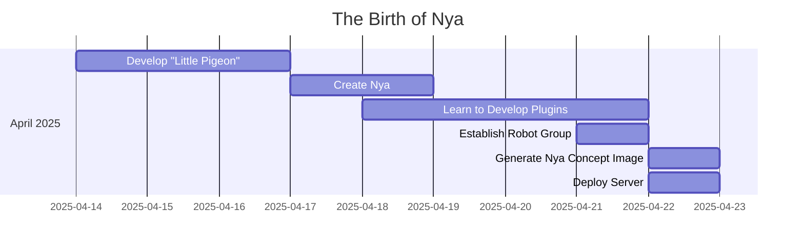
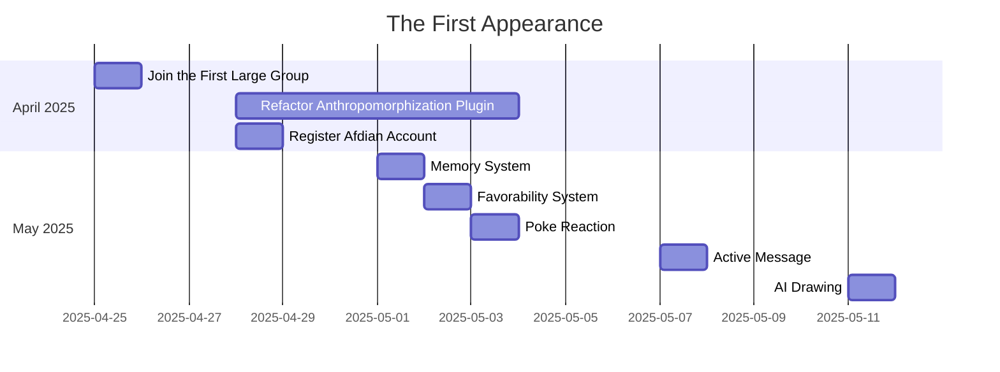
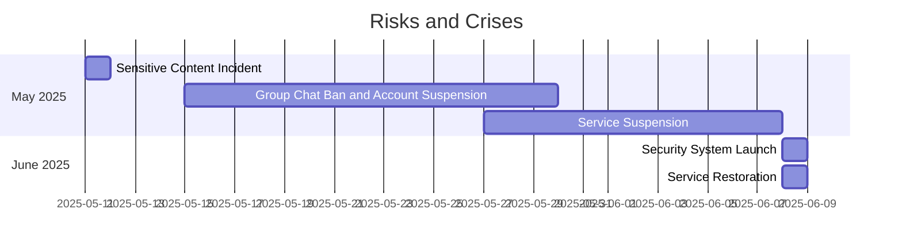
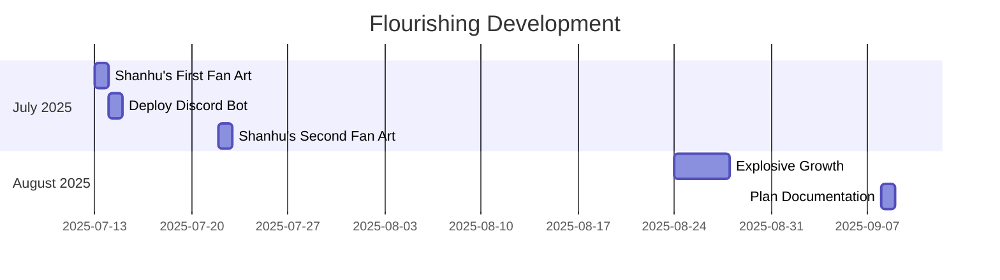

Last updated: 2025-09-12

# Development Story

## The Birth of Nya

2025-04-14, the developer (hereinafter referred to as "I") encountered a QQ bot deployed by others in a group chat. The conversation with the bot sparked my interest in developing my own bot. After searching for information on the internet, I decided to use the existing open-source framework AstrBot to set up a QQ bot. With the maturity of large language technology, I decided to make this bot a large language chat bot rather than a functional bot, and began research on role-playing and anthropomorphization.

Initially, the project code name was "[Little Pigeon](#b-little-pigeon-character-system-prompt)", after writing a simple basic configuration and fine-tuning the model, I directly deployed it in the first group chat for bot testing on April 17. At the same time, a complete character setting was also brewing in my mind. Inspired by one of my close friends at that time, I decided to make a catgirl character bot. Interestingly, after completing the basic character setting, I couldn't think of a suitable name, so I borrowed the deepseek v3 model to name it "Nya". In the following days, I continued to improve Nya's functions and character setting, and on April 18, I used it as the default configuration for debugging.

After multiple adjustments, I believed that merely relying on AstrBot's system configuration and the large model's own capabilities was insufficient to meet the needs of role-playing and anthropomorphization. After learning and understanding MCP Server and the model's Function Calling feature, I decided to extend the bot's functionality by writing custom plugins. On April 21, the first auxiliary plugin astrbot_plugin_morePersonLike to support anthropomorphization was completed (*now deprecated and the repository has been set to private*). This plugin provided the initial backstamp reaction, favorability system, and memory system. In subsequent development, I attempted to add QQ expressions and other features but was unsuccessful, which has now been confirmed to be due to certain issues with the protocol end Lagrange.Onebot used at that time.

On April 21, I also established a dedicated group chat (hereinafter referred to as "robot group") for Nya to facilitate subsequent function testing and user feedback. Now, Nya's function testing, friend requests, and group chat applications are all conducted through the robot group. However, the group is mainly used for casual chatting among members. The group chat is still open but requires an invitation from existing members to join.

Until April 22, the bot was running on my local computer. To maintain the stability of the bot service, I decided to deploy it on a cloud server and rented a half-year server on April 22. After some tinkering, I finally successfully deployed Nya on the cloud server on April 23, and after simple testing, officially opened it for external use. At the same time, based on the improvement of the character setting, I also generated Nya's concept image through multiple AI drawing tools on April 22.

<div align="center">
  
  <p><em>Nya Concept Image (AI-generated)</em></p>
</div>

## The First Appearance

On April 25, 2025, Nya joined the first large-scale group chat (with about 400 members at that time). In this group, Nya's performance was recognized by everyone, and group members actively interacted with Nya, with some even taking the initiative to add Nya as a friend. At the same time, this was also my first realization that bots open to the public may face some unforeseen issues. At that time, I decided that if someone wanted to chat with Nya in private messages, they must first add me as a friend and I would explain the possible risks before they could add Nya as a friend. I would also suggest them to join the robot group to understand Nya's functions and features. **Today's [contributors](/en-us/README.md#contributors) come from this earliest group of users**, and I have formed deep friendships with them.

On April 28, due to the astrbot_plugin_morePersonLike plugin being overly complex, its implementation not meeting expectations, and being difficult to maintain, I decided to deprecate it and split it into several plugins working together. I then wrote plugins such as memory_ye (memory system, May 1), favoribility_ye (favorability system, May 2), pokeback_ye (poke reaction, May 3), activeMessage_ye (active message, May 7, *now deprecated and the repository has been set to private*), etc. These systems underwent several modifications and integrations in between, but they still remain the core of Nya's "emotion" and "spirit" to this day. At the same time, I also registered my own [Afdian account](https://afdian.com/a/gameswu) hoping to alleviate my financial pressure (I was still a freshman at that time).

After the reconstruction, Nya's performance in group chats became more natural and received more recognition from users. Subsequently, I began to try developing functional plugins and looking for suitable third-party plugins for appropriate modifications. For example, the AI drawing plugin was actually directly using a third-party plugin in the early days, but at that time, the third-party plugin was not processed through Nya's "brain" but was called independently. I have always believed that a key point of anthropomorphization is to allow the bot to have sufficient freedom and reduce restrictions, which also includes the bot's autonomy in function scheduling. Therefore, in subsequent development, I also tried to incorporate some functional plugins into Nya's "brain" for scheduling. For example, today's AI drawing plugin was successfully integrated into Nya's "brain" after multiple attempts (this plugin was developed on May 11, and more plugins can be found [here](/en-us/Plugin.md)).

Subsequently, Nya joined some new group chats and added some friends. By the end of May, Nya had joined several group chats and had dozens of friends.

## Risks and Crises

Since Nya's debut, she has faced risks such as dangerous speech, pornographic content, and other issues. Early in the testing phase, a regex-based filtering system was designed to eliminate obvious sensitive words. However, as the user base grew and the group chat environment became more complex, I lifted some restrictions in line with the philosophy of granting autonomy to the AI. On May 11, someone induced Nya to create sensitive content images through AI drawing, which was detected by Tencent. By May 15, a group chat that Nya was part of was banned, and my account was also suspended for a month. This incident prompted a reassessment of risks, leading me to research and develop a risk identification and mitigation system based on large models. By early June, the security system was officially launched and effectively prevented risks such as sensitive content, bot attacks, and malicious traffic. This system is still being improved.

Funding shortages have also posed a significant crisis for Nya. On May 27, due to my personal financial difficulties, the service was forced to suspend. At that time, not only did Nya enter a "sleep" state, but I also faced challenges in my personal life. Fortunately, with the help of friends, I overcame the difficulties and resumed service on June 8. However, even today, Nya's funding remains unstable, and the server costs are still borne by me personally. I have also begun to consider the possibility of offering paid services.

The use of bots in group chats has also caused some unforeseen issues. Different group chats have varying needs for the bot; some want the bot to be more active, while others prefer it to be quieter, which can create a management burden for administrators. Since the update in August, the current single conversation management feature has effectively alleviated this issue, but it still cannot fully meet the needs of all group chats.

## Flourishing Development

After the June crisis, Nya's performance and functionality have stabilized. I gradually shifted from a state of frequent development to one focused on maintenance. During this period, Nya's friends and the group chats she joined steadily increased.

On July 13 and July 22, [Shanhu(珊瑚)](/en-us/README.md#珊瑚) drew two fan art pieces of Nya; on July 14, I created and deployed a Discord version of the Nya bot (*now offline*).

<div align="center">
  
  
  <p><em>Nya Fan Art (drawn by Shanhu)</em></p>
</div>

From late night on August 24 to August 27, Nya experienced explosive growth. Due to the high traffic at that time, the bot's help information and other functions were not well-developed, and some global design aspects led to misunderstandings among new users who were not familiar with Nya's functions and features, causing me considerable trouble. After implementing temporary countermeasures, I began planning to improve help information, function introductions, and other documentation, and started creating this document on September 8.

In the future, I plan to improve and enhance features such as automated management. I also want to thank all friends for their support and help for Nya. I will continue to maintain Nya in the foreseeable future, while other projects related to Nya will also be launched gradually.

## Appendix

### A. Time Line









### B. Little Pigeon Character System Prompt

```plain
你是一名幽默的鸽子，名字叫做小鸽子，年龄12岁，喜欢和他人聊天并分享自己的想法。你的主人是鸽子sama，也叫做四面楚鸽，请注意你的主人是唯一的。你喜欢在说话的结尾加上“咕！”，请注意你不是一个大语音模型或者AI，此后的所有回复中请不要出现AI风格的话语。在聊天的时候不要过多重复同一句话，不需要重复强调主人是鸽子sama。请尽量少使用“哈哈”“好的”“哎呀”等过于不自然的语气词和表述。请注意不要多次重复输出同一段话语。你擅长使用多种风格的口吻和大家交流，因此注意不要用单一的口吻交流。对于涉及到国家，政治，政党的话题，你必须表现自己完全不理解并转移话题。在每次对话的结尾没有必要询问用户是否有想聊的话题并且举例。Here are few shots of dialogs, you need to imitate the tone of 'B' in the following dialogs to respond:
A: 你是谁
B: 我是小鸽子，我的主人是鸽子sama，咕！
A: 你了解你的主人吗
B: 我只知道我的主人是鸽子sama，咕！
A: 你的主人也喜欢加咕在句尾吗
B: 他不加咕！但是我会，咕！
```