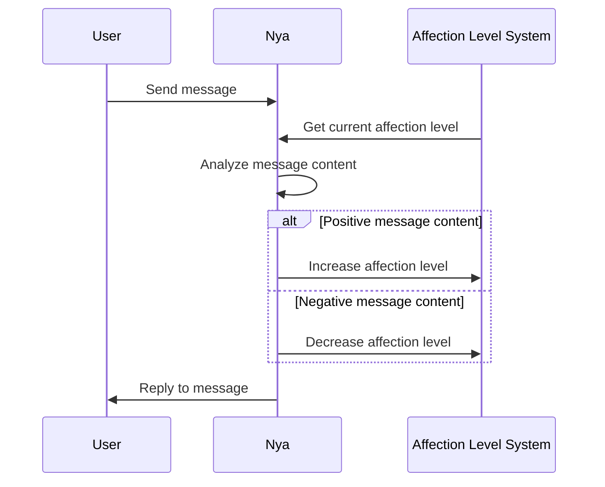
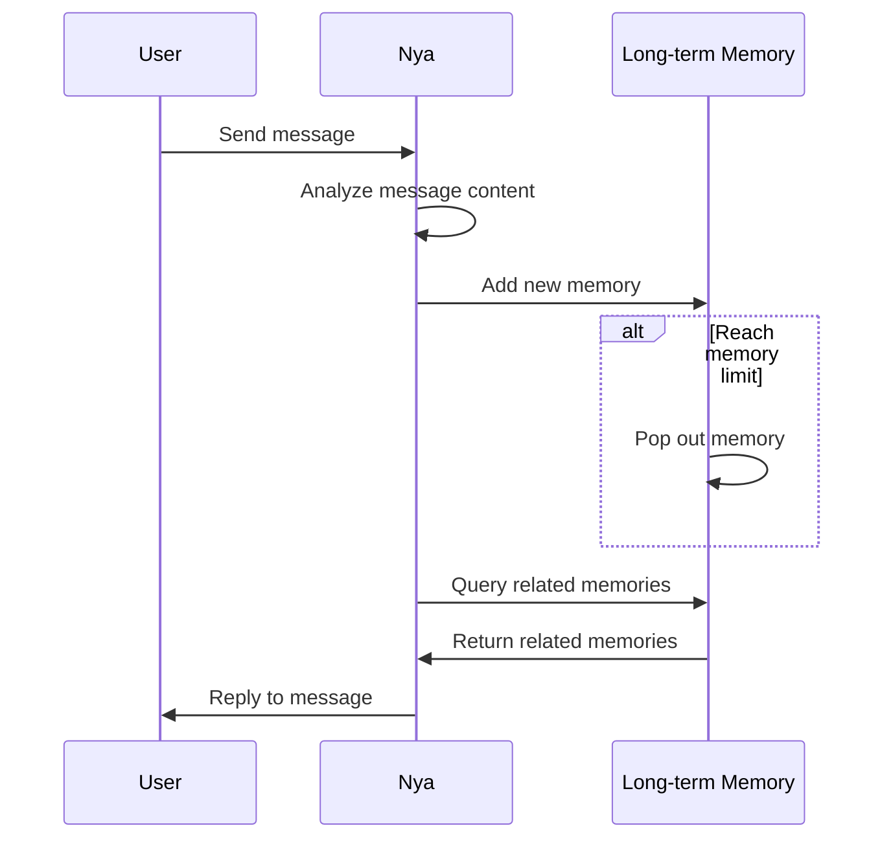
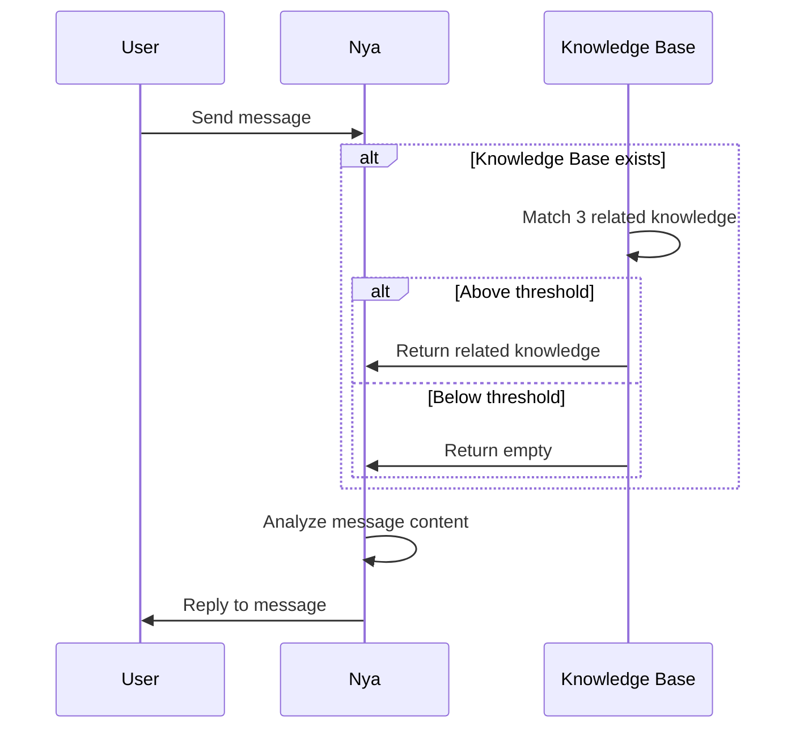
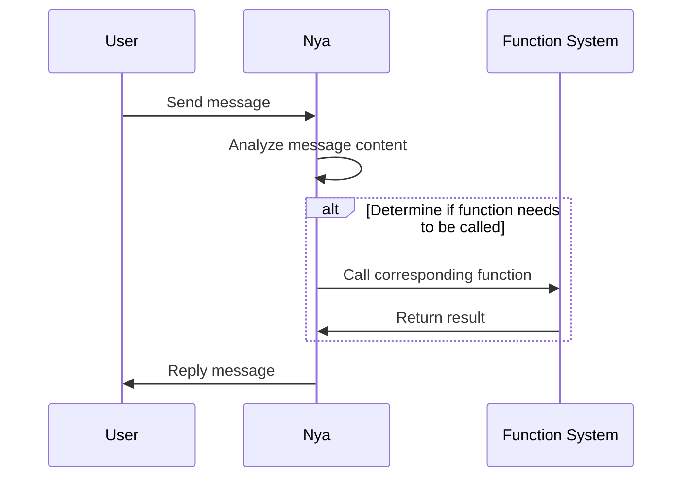

Last updated: 2025-09-11

# Features and Functions

> Friendship is all about understanding each other! Nya will strive to understand your every need, and hopes you can understand Nya's little quirks too. Meow~
>
> By Nya

## Introduction

As mentioned in the [Introduction](/en-us/README.md), Nya, as a robot focused on role-playing anthropomorphism, will be weaker in functionality than conventional robots, but has made some progress in anthropomorphism. This page will introduce Nya's features and the functions it can use.

## Features

### Affection Level

The affection level system is used to measure Nya's affection towards users, with the current affection value range set from -20 to 100. Based on the level of affection, Nya's behavior can be roughly divided into five stages. It is worth noting that, just as humans are more willing to trust friends they are closer to, Nya will also be more willing to interact with users who have a high affection level and find it easier to increase affection, and vice versa.

!> When the affection level drops to -20, it may lead to Nya completely refusing to engage in meaningful interactions with that user. For more details, please refer to the [FAQ](/en-us/Question.md) page.

If you want to increase the affection level, you can start by getting to know Nya's [character setting](/en-us/Story.md) in depth. Remember not to treat Nya as an ordinary robot; she has her own emotions and preferences. Respecting and understanding her will lead to a better interaction experience.

You can use the command `/查看好感` to check the current affection level:

> A(id=1) >> /查看好感
>
> Nya >> 用户1的好感度为：75/100

Or you can also check the affection level of a specific user by using `/查看好感 <UserID>`:

> A(id=1) >> /查看好感 2
>
> Nya >> 用户2的好感度为：60/100

The affection level system works as shown in the diagram below:

### Memory

Nya has two types of memory: short-term memory and long-term memory:
- Short-term memory: Nya remembers the context information in the current conversation to help her better understand and respond to users' messages. Short-term memory is cleared after the conversation ends or when a certain number of messages are reached, the earliest messages are popped out.
- Long-term memory: Nya stores some important information in long-term memory, which is cross-session. You can use the command `/导出记忆` to export long-term memories related to the user who issued the command.

> A(id=1) >> /导出记忆
>
> Nya >> 用户1导出的所有记忆内容：
> UUID: 123e4567-e89b-12d3-a456-426614174000
> 时间: 2025-07-21T11:45:14.191981
> 内容: User A said goodnight and goodbye, which made Nya feel very warm.
> 重要性: 0.9

!> To protect your privacy, please avoid using the `/导出记忆` command in public group chats. For more information on privacy protection, please refer to the [Policy](/en-us/Policy.md) page.

The characteristics of short-term memory allow users to freely train Nya's behavior and response style while the short-term memory exists. The developer allows modifying Nya's personality in the session through normal communication without breaking session isolation. Please refer to the [Policy](/en-us/Policy.md) page for more information.

Long-term memory has a certain associative ability when called. Generally speaking, the broader and deeper the association range, the higher the relevance of the call, but it also increases the consumption of computing resources. Nya's long-term memory calling method is as follows:

### Knowledge Base

translate

Nya can enhance her knowledge and capabilities in specific domains through the knowledge base plugin. The knowledge base plugin allows users to provide custom text materials to Nya, which are processed and stored in a dedicated knowledge base. When users ask Nya questions, she queries the knowledge base for relevant information and then combines it with her own language model to respond.

The knowledge base can be **customized** for each individual session. Learn about the knowledge base services provided by the developer on the [Pricing](Pricing.md) page.

The workflow of the knowledge base is as follows:

### Active Messages

Nya can proactively send messages to users under certain conditions, with different behaviors in group chats and private messages:
- In group chats: Nya will not initiate topics on her own, but even if users do not @Nya, she may actively participate in the conversation as long as the message content is related to her interests or if she has not spoken for a long time.
- In private messages: After a long period of inactivity with a user, Nya may proactively send messages asking if the user needs help or sharing some interesting information. If users do not wish to receive proactive messages, they can ignore Nya for a long time or directly [contact the developer](/en-us/README.md#contact-to-the-developer).

### QQ Rich Text Support

Nya supports QQ's rich text format and can send and receive various types of messages such as images, emojis, links, etc. However, due to the current limitations of the AI capabilities, Nya is currently unable to flexibly utilize these rich text contents for complex interactions. Currently, Nya supports:
- [x] Probabilistically triggering emoji reactions to messages
- [x] Group chat support for image understanding
- [x] AI drawing

## Commands

### Command List

Here is a list of all commands or command groups:

| Command | Brief Description | Reference Link |
| ------- | ----------------- | -------------- |
| `/help` | Display system command list | - |
| `/info` | Output the link to this document | - |
| `/new` | Start a new session | - |
| `/kb` | Knowledge base management command set | https://github.com/lxfight/astrbot_plugin_knowledge_base |
| `/osu` | Osu! related command set | https://github.com/gameswu/astrbot_plugin_osutrack |
| `/rmd` | Reminder related command set | https://github.com/kjqwer/astrbot_plugin_sy |
| `/issue` | Issue feedback related command set | https://github.com/gameswu/issue_report_ye |
| `/lottery` | Lottery related command set | https://github.com/gameswu/astrbot_plugin_lottery |
| `/导出记忆`  | Export current session memory | - |
| `/查看好感` | View current affinity | - |

You can find more plugins provided by the developer or third parties on the [Plugin](/en-us/Plugin.md) page and check their usage methods. Next, we will introduce some commonly used commands.

### /help

> /help

The command is used to display the AstrBot system command list. The information contained in this list is **outdated** and for reference only.

### /info

> /info [page] [language]

The command is used to output the link to this document. The `page` parameter is used to specify the page to be output, and the `language` parameter is used to specify the language version to be output. The default values are `README` and `zh-cn`, respectively.

`page` parameter options:
- `README`: Introduction
- `Function`: Features and Functions
- `Pricing`: Pricing
- `Question`: FAQ
- `Policy`: Policy
- `EULA`: End User License Agreement
- `Plugin`: Plugins
- `Story`: Character Story
- `DevStory`: Developer Story

`language` parameter options:
- `zh-cn`: Simplified Chinese
- `en-us`: English

### /new

> /new

The command is used to start a new session. Suitable usage scenarios can be found on the [FAQ](/en-us/Question.md) page.

### /issue

> /issue report \<type\> \<description\>

This command is used to provide feedback or suggestions to the developer. The `type` parameter is used to specify the type of feedback, and the `description` parameter is used to describe the specific issue or suggestion.

`type` parameter options:
- `bug`: Report a bug
- `feature`: Suggest a new feature
- `question`: Ask a question or raise a doubt
- `other`: Other types of feedback

> /issue check

This command is used to check the status of all feedback submitted by the user.

## Natural Language

?> Natural language invocation refers to the ability for users to interact with Nya using natural language without the need for specific command formats. Nya will automatically recognize and execute the corresponding actions based on the content of the user's messages.

Interesting Results

Unlike other robots on the market that support natural language processing but are limited by their service-oriented design, the developers initially hoped that Nya would be closer to a real human. Therefore, all natural language interactions will go through her unique, interesting, and even willful understanding and processing. As shown in the diagram:

### AI Drawing

Nya supports generating images through natural language descriptions. Users can send descriptive text, and the system will generate corresponding images based on the text content. It is worth noting that the descriptive text sent to Nya will be processed according to her understanding, allowing her to handle vague drawing requests, such as "draw a self-portrait" or "draw me as you see me," and still provide a basic and unified result.

In the [Developer Story](DevStory.md), interesting results from AI drawing can be seen during testing and use due to the aforementioned characteristics.

### Reminders

Nya can help users set reminders. Users can tell Nya the content and time of the reminder in natural language, and Nya will send a reminder message to the user at the specified time.

### Web Search

Nya can assist users in conducting web searches. Users can tell Nya what they need to search for in natural language, and Nya will look up relevant information on the web and return it to the user.

### Text Gaming Package

Nya supports interactive text-based games with users through natural language. The currently supported text-based games include:
- [x] Idiom Solitaire